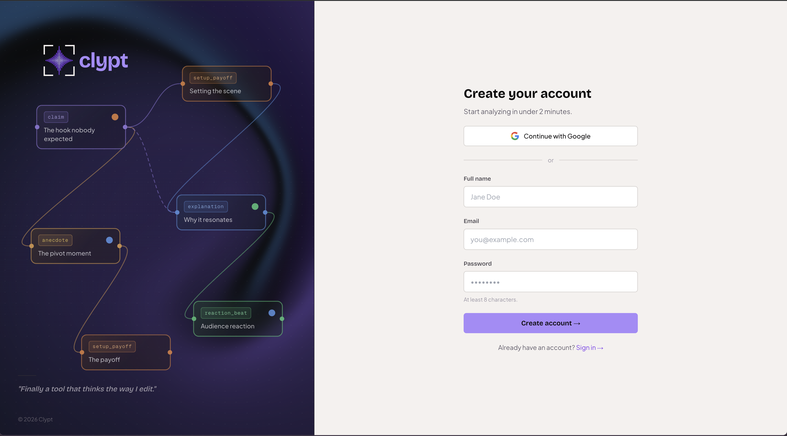
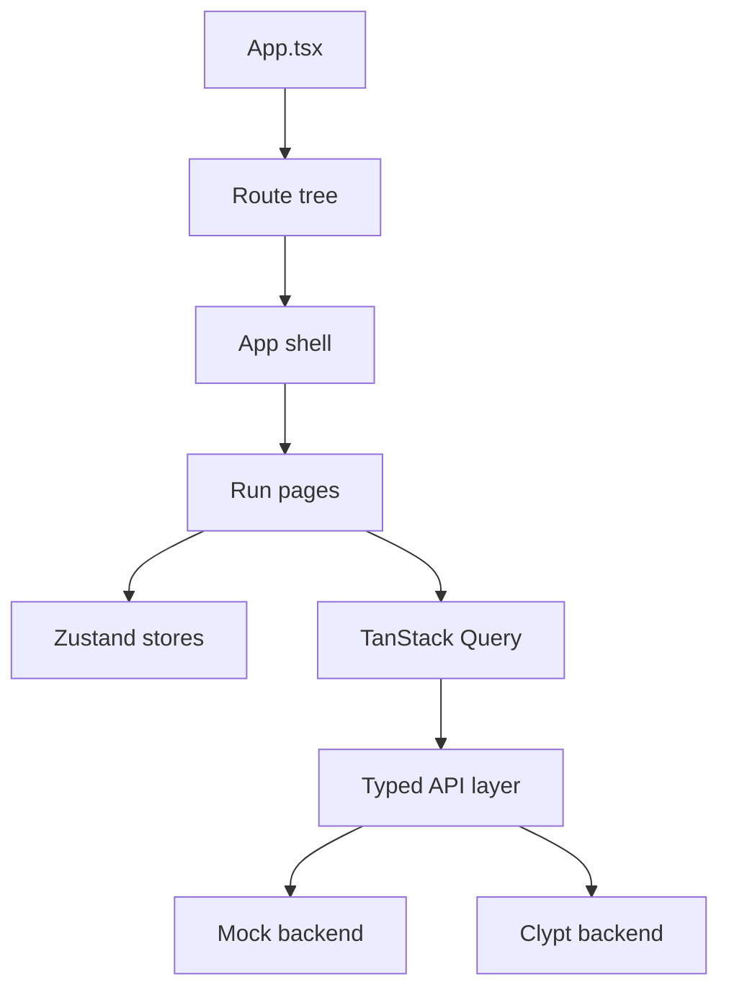

# Clypt Frontend

The interactive frontend for Clypt’s context-aware clipping and content intelligence system.

Clypt exists because most AI clipping tools still treat every upload like an isolated file and every creator like the same channel. They wait for a video, score moments with generic virality heuristics, and return clips with very little awareness of audience behavior, cultural timing, or editorial intent.

Clypt takes a different approach. It combines multimodal video understanding, post-publish audience engagement, and real-time trend detection to surface the right clip at the right moment, whether that moment lives in a video from yesterday or one from eight months ago.

Just as importantly, Clypt does not hide its reasoning. It turns videos and channels into editable context graphs that creators can inspect and steer: follow what comments or trends point to, mark moments as must-include, and refine how the system thinks about narrative structure before export.

This repository is the frontend that makes that system navigable, inspectable, and editable.

## What This Frontend Does

The Clypt frontend is a React single-page app for the six-phase creator workflow:

- ingesting long-form videos
- monitoring pipeline progress
- inspecting the semantic timeline
- exploring the Cortex graph
- searching embedding space
- reviewing ranked clip candidates
- preparing grounding and render workflows

It is designed to make Clypt’s reasoning visible instead of hiding everything behind a “generate clips” button.

## Product Surfaces

### Landing experience

The landing page introduces the product through a cinematic GemSmoke-backed hero, a paste-link CTA bar, a one-shot video-to-balanced-graph-to-clips hero animation, sticky shader-backed phase previews, and real clip cards that play Blob-hosted landing media on interaction. Decorative shader work is deliberately constrained: only the first-viewport hero animates continuously, while lower landing shaders pause offscreen and render frozen high-resolution frames when visible.


### Signup experience

The auth surface carries the same visual system into the first-run experience instead of dropping into a generic form page.



### Onboarding flow

The onboarding sequence walks creators from account setup through workspace readiness in a guided, visual flow.


### Run workspace tour

The app workspace covers the full run lifecycle: overview, timeline, Cortex graph, semantic search, clip candidates, grounding, and render.


## What Makes This UI Different

- **Reasoning-first UI**: graph, search, timeline, and clip views all expose the model’s structure instead of hiding it.
- **Creator steering**: the interface is built for inspection and intervention, not just passive consumption.
- **One system, not two subscriptions**: clipping, graph intelligence, and downstream editing surfaces live in one product.
- **Demo-friendly and backend-ready**: the app runs against a centralized in-memory mock backend by default, but the API layer is typed to the real backend contract.

## Current App Structure

The frontend currently covers:

1. **Public product pages**
   - landing page
   - login/signup
   - onboarding flow
2. **Run workspace**
   - overview
   - timeline
   - Cortex graph
   - search / embeddings
   - clip candidates
   - grounding
   - render
3. **Settings**
   - profile
   - voiceprints

## Stack

- **Framework**: React 18 + TypeScript
- **Build tool**: Vite
- **Styling**: Tailwind CSS + CSS custom properties
- **UI primitives**: shadcn/ui + Radix
- **State**: Zustand + TanStack Query
- **Graph UI**: React Flow + dagre
- **Animation**: Framer Motion
- **Testing**: Vitest + Testing Library + Playwright

## Architecture Overview



Key ideas:

- public routes render standalone
- app routes render inside a shared shell
- server state lives in React Query
- client interaction state lives in Zustand
- the API layer can point either at the real backend or the in-memory mock system

## Mock Mode

The frontend defaults to a realistic mock mode so the UI can be developed and demoed without a live backend:

- `VITE_USE_MOCK_API=true` by default
- typed API calls short-circuit into `src/mocks/api.ts`
- the mock DB is seeded deterministically
- mock lifecycle events simulate phase progression for demo runs

That means you can boot the app and immediately browse a working demo run such as `/runs/demo`.

## Media Assets

- app-facing landing media lives in Vercel Blob; README/docs media stays in Git
- the large seeded demo run video at `public/videos/joeroganflagrant.mp4` is still local-only on purpose
- setup notes for that root demo video live in [public/videos/README.md](public/videos/README.md)

## Repository Map

```text
src/App.tsx                         App providers and route tree
src/pages/                          Route-level pages
src/components/landing/            Landing sections, performance-capped shaders, cursor, and media showcase
src/components/landing/HeroFragments/ Floating hero media cards and mini product fragments
src/components/landing/previews/   App-frame landing phase preview mocks
src/components/graph/              Cortex graph nodes, edges, controls, inspector
src/components/timeline/           Video player and timeline surfaces
src/components/embeds/             Search, scatterplot, and embedding inspection UI
src/components/app/                App shell, run context bar, shared workspace chrome
src/hooks/api/                     TanStack Query hooks over the typed API layer
src/lib/api.ts                     Typed backend/mock API wrappers
src/mocks/                         In-memory mock backend and lifecycle simulation
src/stores/                        Zustand stores
src/types/clypt.ts                 Frontend types aligned to backend models
src/components/landing/landingMedia.ts  Vercel Blob URLs for landing media
docs/                              Architecture, pages, components, styling, evals, error log
```

## Quick Start

### Prerequisites

- Node.js 20.19+ or 22.12+
- npm

### Install and run

```bash
npm install
npm run dev
```

The app runs on:

- `http://localhost:8080`

### Environment

Copy the example if you want local overrides:

```bash
cp .env.example .env.local
```

Important variables:

- `VITE_USE_MOCK_API`
  - `true` by default
  - when truthy, all API calls route through the in-memory mock backend
- `VITE_API_BASE_URL`
  - backend base URL when mock mode is off

## Commands

```bash
npm run dev
npm run build
npm run lint
npm run test
```

## Working With the Backend

This frontend is designed to pair with the Clypt backend, but it is intentionally usable on its own during development.

- default mode: local mock backend
- real mode: typed `/v1/*` API integration
- backend repository: pair this UI with the Clypt backend’s Phase 1-4 pipeline and deploy/runtime docs

## Documentation

If you want the implementation details, start here:

- [Architecture](docs/ARCHITECTURE.md)
- [Components](docs/COMPONENTS.md)
- [Pages](docs/PAGES.md)
- [Styling](docs/STYLING.md)
- [Evals / task router](docs/EVALS.md)
- [Error log](docs/ERROR_LOG.md)

## Status

- current UX scope covers the six-phase creator workflow
- default developer experience is mock-first
- app stack is production-oriented even when backed by mocks
